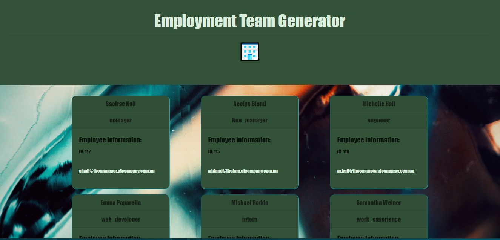

<h1 align="center">Employment Staff Team Generator</h1>
  
 
## Description
ℹ️ Creates a staff team profile for easy access to staff details for the manager of a department
## Table of Contents
- [Description](#description)
- [Installation](#installation)
- [Usage](#usage)
- [License](#license)
- [Video](#video)
- [Screenshot](#screenshot)
- [Contributing](#contributing)
- [Tests](#tests)
- [Questions](#questions)
## Installation
💻 run node start.js
## Usage
📖The project can be cloned and improved with acknowledgement to the original source code
## License

 
This application is covered by the MIT license. 

## Video

<hr<

## Screenshot

## Contributing

🙋‍♀️Michelle Hall

## Tests
 Yes. Run npm run test.

 ## Issues
 Currently there are several issues with this project
 1. Office Number doesn't return value at all
 3. Other fields related to specific roles return as Office Number and throws everything out. BECAUSE THIS IS SHIT!

## Questions
🤔 Any questions regarding this project please email or connect on GitHub 
 
🖐️ Find me on GitHub: [Chelle77322](https://github.com/Chelle77322) 
 
 Email me with any questions:👉 serenynadarra@gmail.com  
_This README was generated with 🤸‍♀️ by [README-generator](https://github.com/Chelle77322/README-Generator)
    
